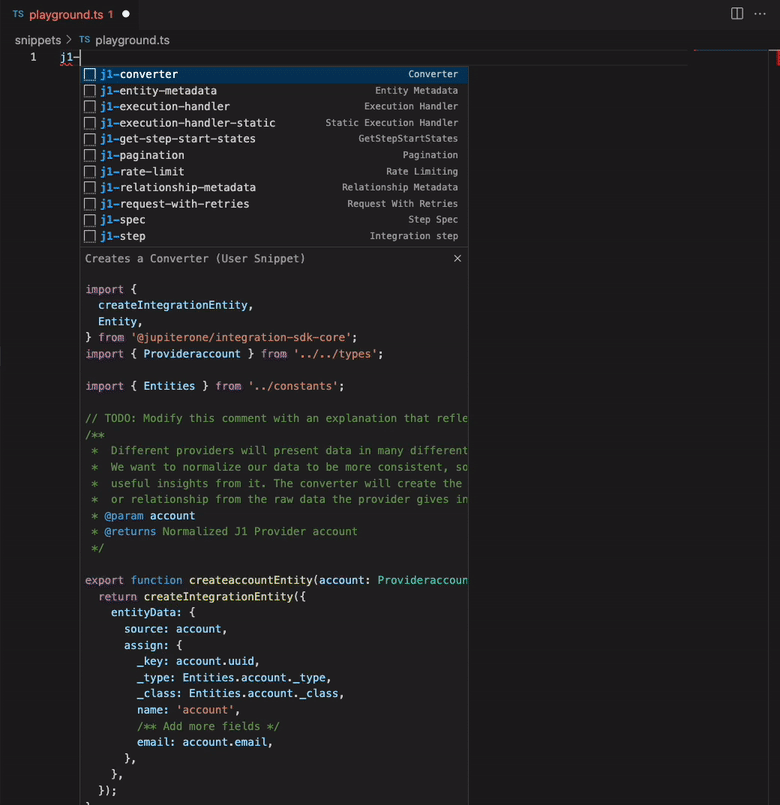
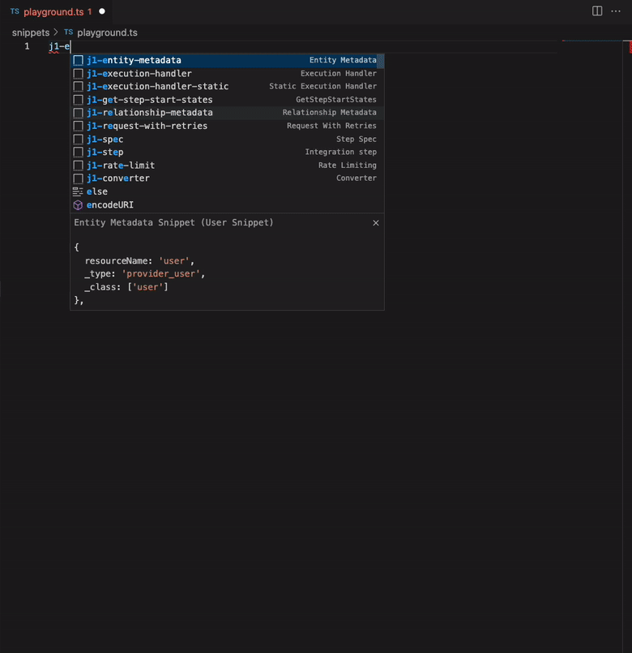
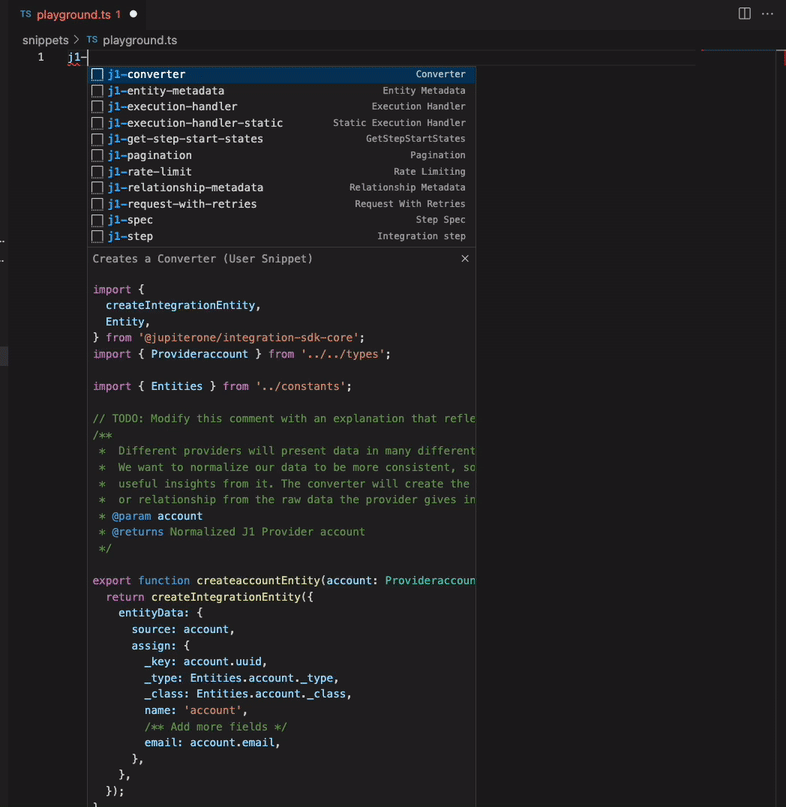
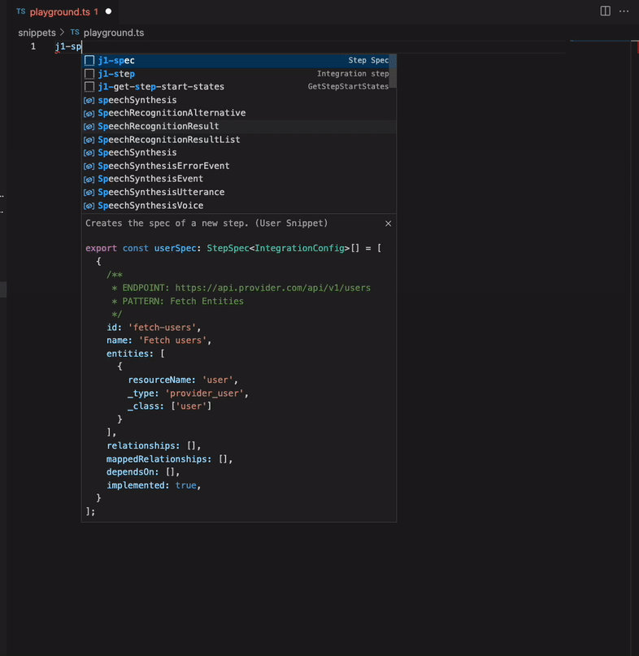
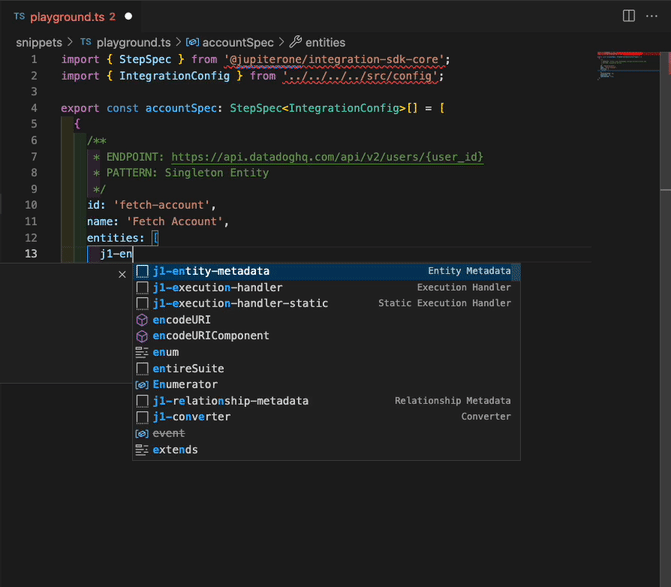
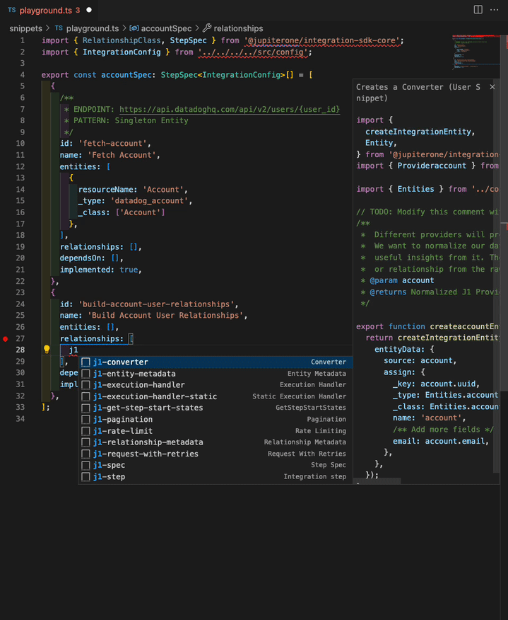

# Integration Code Snippets

These are useful code snippets for common integration patterns

# Installation

If you are using VSCode on a mac you can install these snippets by placing them
(or the whole file) at the following path
`Users/$USER/Library/Application Support/Code/User/snippets/typescript.json`

You can also edit the typescript snippets through the `Configure User Snippets`
command in VSCode

## List of snippets and usage

Below you'll find all the available snippets and the usage of them.

| Name                     | What it does?                                                                                                | How to use it?                                                                                                                                                                                                                                                                                                                                                                                                                            |
| ------------------------ | ------------------------------------------------------------------------------------------------------------ | ----------------------------------------------------------------------------------------------------------------------------------------------------------------------------------------------------------------------------------------------------------------------------------------------------------------------------------------------------------------------------------------------------------------------------------------- | --- |
| Integration Step         | Creates a new integration step                                                                               | **Write** `j1-step` and then hit `tab` **Variables (hit `tab` to jump to the next variable):** 1. Entity: Write it in camelCase: e.g. `user` 2. Relationship array: e.g. `Relationships.ACCOUNT_HAS_USER` 3. Mapped relationships: e.g. `MappedRelationships.USER_IS_ADMIN` 4. Step ids that this step depends on: e.g. `Steps.ACCOUNT, Steps.USERS`   |
| Static Execution Handler | Creates an execution handler with static data                                                                | **Write** `j1-execution-handler-static` and then hit `tab` **Variables (hit `tab` to jump to the next variable):** 1. Entity: Write it in camelCase: e.g. `account`                                                                                                                                                     |
| Execution Handler        | Creates an execution handler that performs an  API call to add multiple entities and/or  relationships | **Write** `j1-execution-handler` and then hit `tab` **Variables (hit `tab` to jump to the next variable):** 1. Entity: Write it in camelCase: e.g. `user` 2. Target Entity Relationship: Write it in camelCase: e.g. `role`                                                                                                        |
| Converter                | Creates a converter                                                                                          | **Write** `j1-converter` and then hit `tab` **Variables (hit `tab` to jump to the next variable):** 1. Provider: Write it in camelCase: e.g. `digitalOcean` 2. Entity: Write it in camelCase: e.g. `account`                                                                                                                                       |
| Step Spec                | Creates the spec of a new step.                                                                              | **Write** `j1-spec` and then hit `tab` **Variables (hit `tab` to jump to the next variable):** 1. Entity: Write it in camelCase: e.g. `account` 2. Provider: Write it in camelCase: e.g. `digitalOcean`                                                                                                                                                      |
| Entity Metadata          | Add Entity Metadata Snippet                                                                                  | **Write** `j1-entity-metadata` and then hit `tab`  **Variables (hit `tab` to jump to the next variable):** 1. Entity: Write it in camelCase: e.g. `account` 2. Provider: Write it in camelCase: e.g. `digitalOcean`                                                                                                                    |
| Relationship metadata    | Add Relationship Metadata Snippet                                                                            | **Write** `j1-relationship-metadata` and then hit `tab` **Variables (hit `tab` to jump to the next variable):** 1. Source Entity: Write it in camelCase: e.g. `account` 2. Target Entity: Write it in camelCase: e.g. `user` 3. Relationship: e.g. `has` 4. Provider: Write it in camelCase: e.g. `github`           |
| Pagination               | Adds a pagination request Snippet                                                                            | **Write** `j1-pagination` and then hit `tab`  **Variables (hit `tab` to jump to the next variable):** 1. Entity: Write it in camelCase: e.g. `user`                                                                                                                                                                                                 |
| Rate limiting            | Adds Rate Limiting Snippet                                                                                   | **Write** `j1-rate-limit` and then hit `tab`                                                                                                                                                                                                                                                                                                              |
| Request With Retries     | Adds a new method to perform API requests  with retries and/or rate limit checks                          | **Write** `j1-request-with-retries` and then hit `tab`                                                                                                                                                                                                                                                                                |     |
